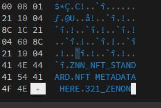

## stego_example  

Simple proof of concept that demonstrates the ability to append arbitrary data to a file without impacting functionality.  

Use a file-to-hex converter like https://hexed.it to compare the input vs output.  

Example
